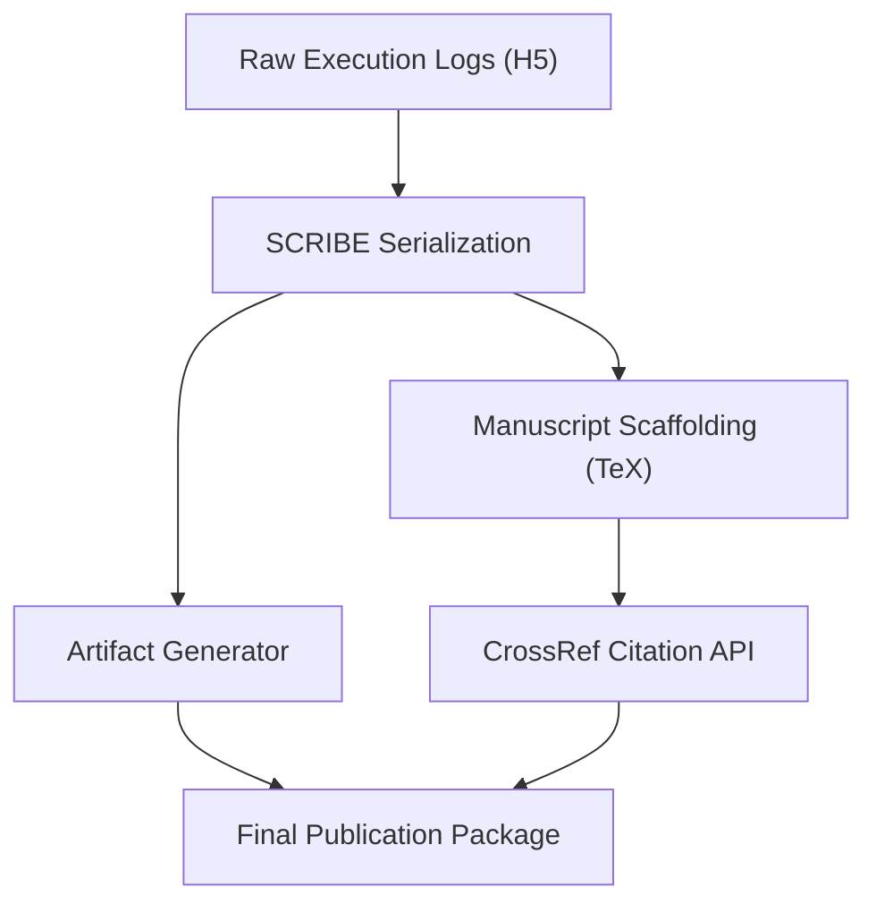

# CoChem-SCRIBE: Asynchronous Data Provenance & Publication Daemon

## PI & Metadata
- **PI/Developer:** Dr. Joshua John Klaassen
- **ORCiD:** [0009-0007-1506-4401](https://orcid.org/0009-0007-1506-4401)
- **GitHub Organization:** [ProfJJK-CoChem](https://github.com/ProfJJK-CoChem)
- **CoChem User Manual:** [CoChem_User_Manual.md](https://github.com/ProfJJK-CoChem/CoChem-BASE/blob/main/CoChem_User_Manual.md)
- **Method Matrix:** [Method_Matrix.md](https://github.com/ProfJJK-CoChem/CoChem-BASE/blob/main/Method_Matrix.md)

*Note: CoChem has recently migrated to the Valeev Stack (MPQC, F12) for enhanced electron correlation accuracy and rigorous quantum mechanical descriptions [M].*

## What This Repository Does
**CoChem-SCRIBE** operates silently in the background of the CoChem suite. It acts as an automated scientific secretary, dynamically translating raw execution states into academically rigorous, publication-ready artifacts. 

Key capabilities include:
- **Memory-Aware Serialization:** Monitors the memory footprint of `cochem_state.h5`. When tensors exceed safety thresholds, SCRIBE chunks and compresses payloads via Zstandard into 500MB [D] batches to prevent Jupyter kernel crashes [M].
- **Artifact Visualization:** Generates HTML 3D carousels, `.cube` NCI domains, Sinc-DVR probability wavefunctions mapped onto classical potentials, and high-resolution `.svg` Voigt spectral convolutions.
- **Manuscript Scaffolding:** Translates execution logs directly into an APS-compliant `Methodology.tex`. It queries the CrossRef API dynamically for citations and manages the `.bib` file natively.
- **LAM Protocol Justification:** Injects mathematically rigorous justifications into the LaTeX manuscript when the `LAM_TRIGGER_REQUIRED` flag is activated, detailing why Sinc-DVR supersedes standard rigid-rotor harmonic oscillator (RRHO) approximations.

### Data Flow Architecture

## Setup & Installation
1. Clone the repository: `git clone https://github.com/ProfJJK-CoChem/CoChem-SCRIBE.git`
2. SCRIBE relies on the shared CoChem backend. Ensure you have `jinja2`, `zstandard`, and `matplotlib` installed in your global environment.
3. Validate your local LaTeX engine (e.g., `texlive` or `miktex`) is correctly mapped in your `$PATH` for PDF compilation.

## Getting Started
SCRIBE runs autonomously. You can manually force an artifact synchronization by executing:
`python cochem_scribe_master.py`
To view generated `.tex` files, check the `templates` and `generated_figures` directories. All final payloads are securely archived. Refer to the [User Manual](https://github.com/ProfJJK-CoChem/CoChem-BASE/blob/main/CoChem_User_Manual.md) for custom formatting and CrossRef overrides.

---
